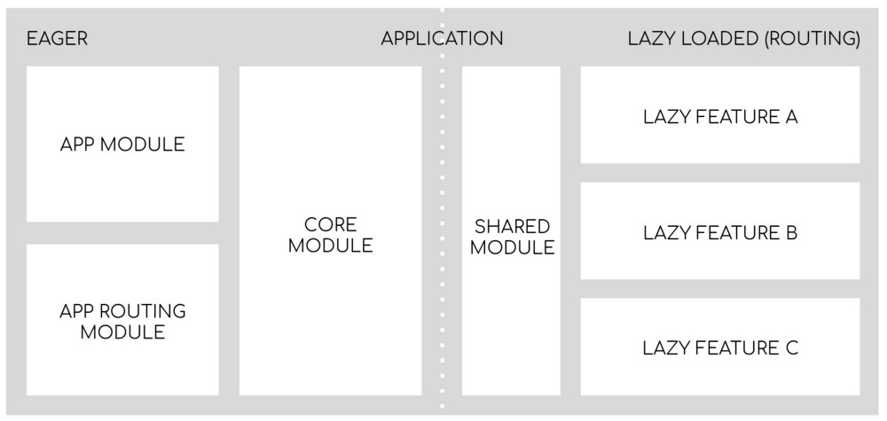

> **AVISO IMPORTANTE: Este schematic é compatível com a versão 12 do Angular CLI com strict mode desativado**

[Esta](https://github.com/wizsolucoes/angular-starter-schematic/issues/56) issue está aberta para fazer a adequação. Enquanto isso é necessário usar CLI com `--strict=false`.

<!-- omit in toc -->
# Wiz Angular Starter Schematic

- [Sobre](#sobre)
- [Uso](#uso)
  - [Opções](#opções)
    - [White-label](#white-label)
- [Sobre a aplicação gerada](#sobre-a-aplicação-gerada)
  - [Estrutura](#estrutura)
  - [Recursos](#recursos)
    - [Integração NGX Wiz SSO](#integração-ngx-wiz-sso)
    - [Monitoramento com Application Insights](#monitoramento-com-application-insights)
    - [Commit lint](#commit-lint)
    - [Configuração Prettier](#configuração-prettier)
    - [CI/CD](#cicd)
- [Desenvolvimento do schematic](#desenvolvimento-do-schematic)
  - [Por onde começar](#por-onde-começar)
  - [Testando o schematic localmente](#testando-o-schematic-localmente)
    - [1. Gere um distribuível do schematic](#1-gere-um-distribuível-do-schematic)
    - [2. Gere uma nova aplicação e instale e execute o schematic](#2-gere-uma-nova-aplicação-e-instale-e-execute-o-schematic)
  - [Aprenda mais sobre schematics](#aprenda-mais-sobre-schematics)

## Sobre

Schematic para gerar código boilerplate com a arquitetura de referência corporativa para aplicações Angular. Compatível com as [versões suportadas do Angular](https://angular.io/guide/releases#support-policy-and-schedule) e otimizado para as versões ^10.0.0.

## Uso

**IMPORTANTE: Este schematic supõe que a aplicação usa SASS e deve ser executado em projetos novos, pois faz a sobrescrita de arquivos.**

```bash
# Gerar uma nova aplicação Angular
ng new my-app --style=scss

# Entrar na pasta da nova aplicação
cd my-app

# Adicionar arquitetura
ng add @wizsolucoes/angular-starter

# Executar testes
npm run test:ci

# Rodar aplicação
ng serve
```

*Obs: se estiver usando o gitbash e encontrar o erro abaixo ao executar ng add @wizsolucoes/angular-starter, execute o comando no gitbash do VSCode ou no powershell.

```bash
$ ng g @wizsolucoes/angular-starter:ng-add
Schematic input does not validate against the Schema: {}
Errors:

  Data path "" should have required property 'white-label'.
```

### Opções

#### White-label

Ao executar o schematic, você deve escolher se a aplicação é 'White-label' ou não, respondendo este prompt na linha de comando:

```bash
? Essa aplicação é 'White-Label'? (Y/n)
```

Para entender mais sobre a arquitetura 'White-label', consulte [a documentação neste repositório.](./docs/white-label.md)

## Sobre a aplicação gerada

### Estrutura

A aplicação tem 2 partes principais:

- A parte "eager" que será carregada na inicialização na aplicação (o `main.js` bundle).
- A parte "lazy" composta por funcionalidades da aplicação e que será carregada sob demanda como resultado da navegação do usuário.



Esta é a estrutura de pastas proposta:

```bash
|-- core
    |-- [+] authentication
    |-- [+] guards
    |-- [+] http
    |-- [+] interceptors
    |-- [+] mocks
    |-- [+] services
    |-- [+] layout

|-- features
    |-- feature1
        |-- feature1-routing.module.ts
        |-- feature1.component.html
        |-- feature1.component.scss
        |-- feature1.component.ts
        |-- feature1.component.spec.ts
        |-- feature1.service.ts
        |-- feature1.module.ts

    |-- feature2 
        |-- [+] components
        |-- feature2-routing.module.ts
        |-- feature2.service.ts
        |-- feature2.module.ts

|-- shared
    |-- [+] components
    |-- [+] models
    |-- [+] directives
    |-- [+] pipes

|-- app-routing.module.ts
|-- app.component.html
|-- app.component.scss
|-- app.component.ts
|-- app.component.spec.ts
|-- app.module.ts
```

<!-- omit in toc -->
#### Core

O core module deve conter serviços singleton, componentes universais e outros recursos em que há uma instância única. Autenticação, header, interceptors são exemplos de componentes que terá apenas uma instância ativa para a aplicação e será utilizado praticamente por todos os modules.

<!-- omit in toc -->
#### Features - Módulos Lazy Loaded

Módulos lazy loaded ajudam a diminuir o tempo de inicialização da aplicação. Com o lazy load, o aplicativo não precisa carregar tudo de uma só vez. Ele só vai carregar o que o usuário espera ver. O módulo só irá carregar quando o usuário navegar para sua rota.

Observe que se o módulo de _feature_ tiver mais de um componente, criamos sub-pastas para a cada componente (Ex. `feature2`) para que nenhuma pasta tenha mais de 6 arquivos conforme a [recomendação](https://angular.io/guide/styleguide#flat) do style guide do Angular.

> Para gerar um novo módulo *lazy loaded* use a o schematic `ng generate module` com a flag `--route`. Por exemplo, para gerar uma nova rota `/privacy`:

```bash

ng g m features/privacy --route privacy --module app.module.ts
```

<!-- omit in toc -->
#### Shared

O shared é onde todos os componentes compartilhados, pipes, filters e services devem ir. O shared pode ser importado em qualquer module. Assim esses itens serão reutilizados. O shared module deve ser independente do restante do aplicativo. Portanto, não deve ter referências de outro módulo.

<!-- omit in toc -->
#### Referências

A estrutura é inspirada nas seguintes fontes:

- [Como estruturar componentes em grandes projetos - Bruno Brito](https://www.brunobrito.net.br/estruturando-components-angular/)
- [How to architect epic Angular app in less than 10 minutes! - Tomas Trajan](https://medium.com/@tomastrajan/how-to-build-epic-angular-app-with-clean-architecture-91640ed1656)
- [Application structure and NgModules - Angular coding style guide](https://angular.io/guide/styleguide#application-structure-and-ngmodules)

### Recursos

O seguintes recursos já estão implementados na aplicação starter. Para alguns dos recursos é necessário fazer uma configuração antes de utilizá-los.

#### Integração NGX Wiz SSO

Integração com [NGX Wiz SSO](https://github.com/wizsolucoes/ngx-wiz-sso). Um módulo Angular feito para facilitar processo de autenticação e renovação de token no SSO da Wiz.

<!-- omit in toc -->
##### Configuração SSO

Adicione as configurações de SSO do seu projeto aos arquivos da pasta [src/environments](./src/starter/files/src/environments).

```typescript
ssoConfig: {
    apiPath: '<<urldo servico>>',
    clientID: '<<Cliente ID>>',
    clientSecret: '<<Cliente Secret>>',
    grantType: '<<Grant Type>>',
    authedPaths: ['<<dns a ser autenticado>>'],
    scope: '<<scope do projeto>>',
    options: {
      // parâmetro opcional
      ssoTimeOut: 60000, // parâmetro opcional, determina o timeout para o SSO
      tokenAutoRefresh: true, // parâmetro opcional, determina se o token deve ser renovado
      loginRoute: 'login', // url que aponta para onde redirecionar no caso de não haver token
    },
```

O módulo do NGX Wiz SSO está importado no `CoreModule`.

```typescript
@NgModule({
  declarations: [MainLayoutComponent, NavComponent],
  imports: [
    BrowserModule,
    RouterModule,
    HttpClientModule,
    NgxWizSSOModule.forRoot(environment.ssoConfig), // <--- import do NGX Wiz SSO
  ],
  exports: [MainLayoutComponent, NgxWizSSOModule],
})
export class CoreModule {}
```

O componente `login` tem um botão de "Entrar" que exemplifica como usar o plugin. Para entender melhor as configurações consulte a documentação do projeto [NGX Wiz SSO](https://github.com/wizsolucoes/ngx-wiz-sso).

#### Monitoramento com Application Insights

Monitoramento de erros e de performance da aplicação Angular usando o [Azure Application Insights](https://docs.microsoft.com/en-us/azure/azure-monitor/app/javascript).

<!-- omit in toc -->
##### Configuração Application Insights

Adicione sua chave de instrumentação ao [arquivo de variáveis por ambiente](./src/environments/environment.prod.ts):

```typescript
export const environment = {
  production: true,
  appInsights: {
    instrumentationKey: 'YOUR-APPLICATION-INSIGHTS-INSTRUMENTATION-KEY',
  },
};
```

#### Commit lint

As mensagens de commit devem seguir a convenção de [Conventional commits](https://www.conventionalcommits.org/en/v1.0.0/) que é o padrão para todos os projetos da Wiz. Este projeto já tem commit lint configurado com [husky](https://github.com/typicode/husky) para te ajudar. [Consulte a convenção Angular se tiver dúvidas sobre o tipo correto para seu commit.](https://github.com/angular/angular/blob/22b96b9/CONTRIBUTING.md#type)

#### Configuração Prettier

O código gerado contem arquivos de configuração da ferramenta de formatação [Prettier](https://prettier.io/) e cria dois scripts npm:

```json
  "scripts": {
    "//": "...",
    "format:check": "prettier **/*.{html,ts,js,json,scss} --check",
    "format:write": "prettier **/*.{html,ts,js,json,scss} --write"
  },
```

#### CI/CD

O código gerado irá conter um arquivo `azure-pipelines.yml` com a configuração de integração contínua de de deploy da aplicação.

## Desenvolvimento do schematic

### Por onde começar

```bash
# Clonar o repositório
git clone git@github.com:wizsolucoes/angular-starter-schematic.git

# Entrar na pasta do schematic
cd angular-starter-schematic

# Instalar as dependências
npm install

# Buildar schematic
npm run build

# Executar os testes
npm test
```

### Testando o schematic localmente

#### 1. Gere um distribuível do schematic

```bash
# Instalar as dependências
npm install

# Buildar schematic
npm run build

# Gerar tarball eg. wizsolucoes-angular-starter-1.0.1.tgz
npm pack
```

#### 2. Gere uma nova aplicação e instale e execute o schematic

```bash
# Gerar uma nova aplicação Angular em outra pasta para testar o schematic
ng new my-app --style=scss

# Entrar na pasta da nova aplicação
cd my-app

# Instalar schematic
npm i --no-save ../<path-to>/angular-starter-schematic/wizsolucoes-angular-starter-x.x.x.tgz

# Executar schematic
ng g @wizsolucoes/angular-starter:ng-add
```

### Aprenda mais sobre schematics

- [Generating code using schematics](https://angular.io/guide/schematics)
- [Total Guide To Custom Angular Schematics](https://medium.com/@tomastrajan/total-guide-to-custom-angular-schematics-5c50cf90cdb4)
