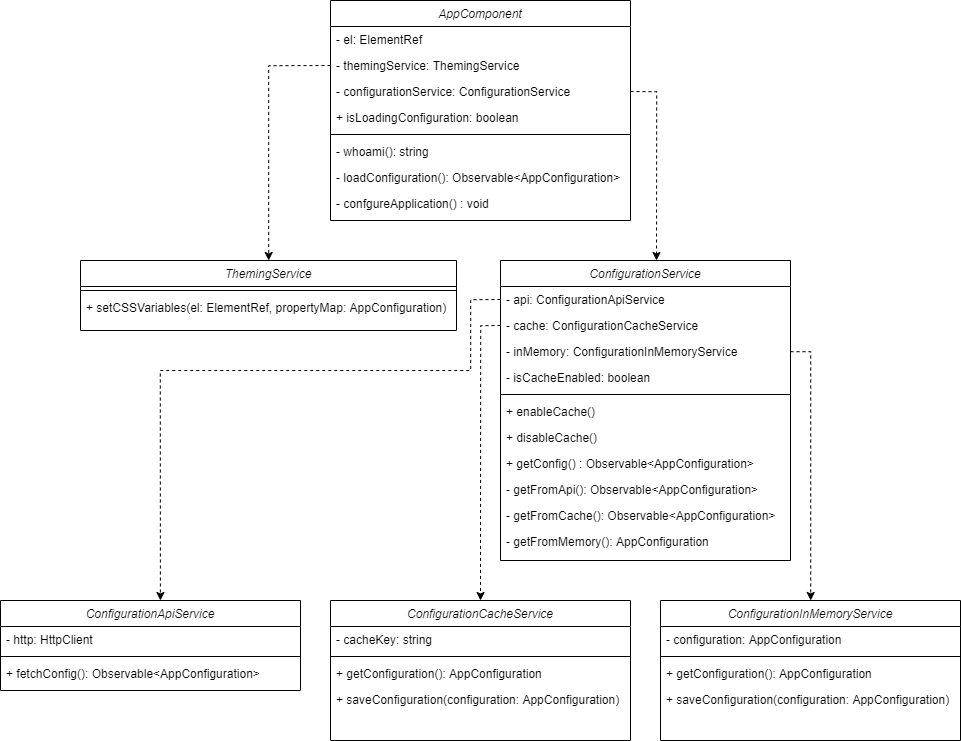
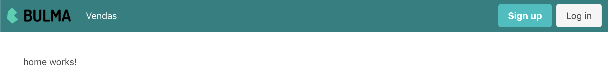
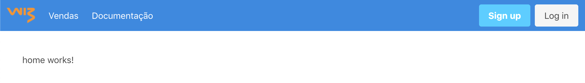

- [Arquitetura white-label](#arquitetura-white-label)
  - [Diagrama de classes](#diagrama-de-classes)
  - [AppComponent](#appcomponent)
  - [ThemingService](#themingservice)
  - [ConfigurationService](#configurationservice)
  - [ConfigurationApiService](#configurationapiservice)
  - [ConfigurationCacheService](#configurationcacheservice)
  - [ConfigurationInMemoryService](#configurationinmemoryservice)
- [Experimente](#experimente)
  - [1. Configure os recursos](#1-configure-os-recursos)
  - [2. Instale as dependências](#2-instale-as-dependências)
  - [3. Rode o servidor de teste](#3-rode-o-servidor-de-teste)
  - [4. Modifique a resposta do servidor de teste](#4-modifique-a-resposta-do-servidor-de-teste)
  - [Exemplos](#exemplos)
    - [Exemplo 1](#exemplo-1)
    - [Exemplo 2](#exemplo-2)


# Arquitetura white-label
Aplicações geradas com a opção `white-label`, têm a seguinte estrutura:

## Diagrama de classes



## AppComponent

O componente base da aplicação Angular. O componente usa a url para se identificar, solicita sua configuração do serviço de configuração e delega a customização visual ao serviço de tema.

O método `whoami` e responsável por identificar o _tenant_ baseado na url da aplicação.

## ThemingService

Serviço de tema responsável por aplicar configurações visuais ao DOM.

## ConfigurationService

Serviço de configuração que é efetivamente um repositório dos dados de configuração, no sentido do *repository pattern*. *ConfigurationService* tem como dependência *ConfigurationInMemoryService*, *ConfigurationCacheService*, *ConfigurationApiService* que servem como fontes de dados.

O serviço de configuração consulta os dados na seguinte ordem de preferência:
1. Dados em memória
2. Dados em cache, se o cache estiver habilitado
3. API

O uso do cache pode ser habilitado e desabilitado pelo serviço de configuração.

Os dados sempre são guardados em memória após consulta independente da fonte.

De forma geral, este é o serviço que deve ser injetado nos componentes da aplicação que dependem de configuração.


## ConfigurationApiService
Serviço responsável por fazer uma requisição **http** para buscar a configuração.

## ConfigurationCacheService
Serviço responsável por usar o **local storage** para buscar e guardar a configuração.

## ConfigurationInMemoryService
Serviço responsável por buscar e guardar a configuração **em memória**.

# Experimente
Depois de gerar uma aplicação Angular com a arquitetura white label. Siga estes passos para experimentar com a configuração.

## 1. Configure os recursos
Primeiramente, configure os [recursos](#estrutura-e-recursos) da aplicação, como a configuração de SSO.

## 2. Instale as dependências
```
npm install
```

## 3. Rode o servidor de teste
A aplicação angular *starter* faz uma requisição `GET` para `http://localhost:3000/config` para buscar a configuração. O projeto tem um [`json-server`](https://github.com/typicode/json-server) que pode ser usado para responder essa requisição.

Em um terminal rode o servidor:
```
npm run server
```

Em outro terminal rode a aplicação Angular:
```
npm start
```

## 4. Modifique a resposta do servidor de teste
Para mudar as respostas do servidor e visualizar como a aplicação se comporta, modifique o arquivo `/server/db.json` e atualiza a página do browser onde a aplicação está rodando.

## Exemplos
Repare nos exemplos a seguir como o tema, a logo e a disponibilidades de funcionalidades são configurados de acordo com o a url da aplicação e o conteúdo do arquivo [/server/db.json](./server/db.json).

### Exemplo 1
```json
{
  "theme": {
    "primary-color": "teal"
  },
  "logoImageUrl": "https://bulma.io/images/bulma-logo.png",
  "features": ["sales"]
}
```


### Exemplo 2
```json
{
  "theme": {
    "primary-color": "#1E88E5"
  },
  "logoImageUrl": "https://raw.githubusercontent.com/wizsolucoes/angular-white-label/master/docs/logowiz.png",
  "features": ["sales", "documentation"]
}
```
